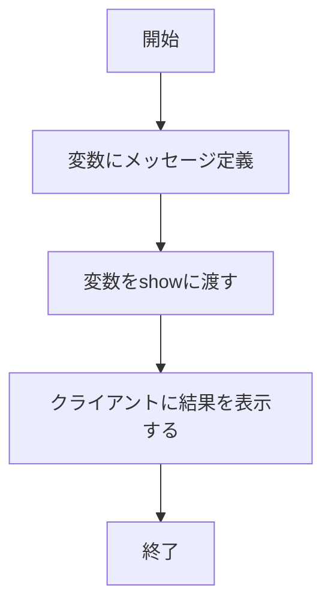
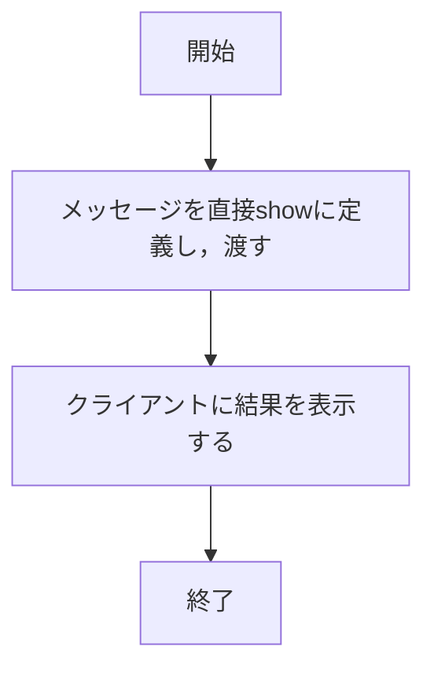
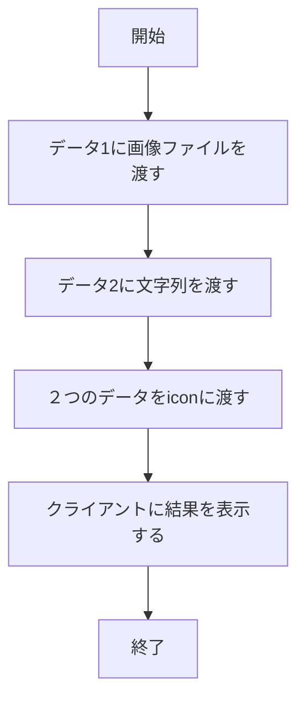

# app5.jsの全体の説明

app5.jsは，シンプルなWebページを使用するための複数の機能が実装してある．それぞれのWebの使用手順や機能について説明をする．

##　ファイル一覧

ファイル名 | 説明
-|-
app5.js | プログラム本体
/views/show.ejs | 挨拶を表示
/views/icon.ejs | 画像を表示
/views/luck.ejs | おみくじの結果を表示
/views/janken.ejs| NPCとじゃんけんし，結果を表示
/views/nazonazo.ejs | 出題されたなぞなぞを回答し，正誤判定を表示
/views/dentaku.ejs | 簡易的な数式を計算し，表示
/culculator.js | 四則計算処理を実行
/public/apple_logo_black.svg | 画像のデータ

##　使用手順及び機能の説明
### （１）hello1
#### 使用手順
はじめに以下の文章を入力し，サーバをポート8080で起動する．

```
node app5.js
```

次に，検索エンジンに「 http://localhost:8080/hello1 」と入力し検索する．

挨拶が表示される．

#### 機能
ここでは，表示させる文章をmessage1とmessage2という変数にそれぞれ「Hello World」と「Bon jour」という文字列を格納し，指定したテンプレートファイルをレンダリングしてWebページに挨拶を表示させる．

### （2）hello2
#### 使用手順
はじめに以下の文章を入力し，サーバをポート8080で起動する．

```
node app5.js
```

次に，検索エンジンに「 http://localhost:8080/hello2 」と入力し検索する．

挨拶が表示される．

#### 機能
(1)と同じく，「Hello World」と「Bon jour」という挨拶を表示させているが，表示させるまでの方法が少し異なっている．(1)では変数を用いて文章を表示させているのに対して，(2)では変数を用いずに文章を直接オブジェクトに指定して表示させる．

### （3）icon
#### 使用手順
はじめに以下の文章を入力し，サーバをポート8080で起動する．

```
node app5.js
```

次に，検索エンジンに「 http://localhost:8080/icon 」と入力し検索する．

画像と名前が表示される．

#### 機能
これはWebページに画像を表示させる．上記のURLにアクセスすると，filenameとaltというデータがicon.ejsのテンプレートに渡して，src属性とalt属性が使用することでpublicフォルダにデータとして収納されている画像が表示される．

### （4）luck
#### 使用手順
はじめに以下の文章を入力し，サーバをポート8080で起動する．

```
node app5.js
```

次に，検索エンジンに「 http://localhost:8080/luck 」と入力し検索する．

おみくじが引かれ，運勢を表示する．

#### 機能
ランダム関数によって出た各数字におみくじの結果を指定し，対応する文章をif関数を用いて表示させることでおみくじを引くことができる．そのため，Webページを再読み込みするたびにおみくじを引き直すこともできる．

### （5）janken
#### 使用手順
はじめに以下の文章を入力し，サーバをポート8080で起動する．

```
node app5.js
```

次に，検索エンジンに「 http://localhost:8080/janken」と入力し検索する．

じゃんけんの手を入力し，送信する．その後コンピュータの手と勝敗判定と総試合数と勝利数が表示される．

#### 機能
コンピューターとユーザーでじゃんけんができる．コンピュータはランダム関数を使用し，出た数字と「グー」「チョキ」「パー」を対応させてランダムにじゃんけんの手を出させる．ユーザーは自分の手を入力し，if関数を用いて勝敗を比較する．総試合数を1増やし，勝った場合は勝利数を1増やして表示するようにした．

### （6）nazonazo
#### 使用手順
はじめに以下の文章を入力し，サーバをポート8080で起動する．

```
node app5.js
```

次に，検索エンジンに「 http://localhost:8080/nazonazo 」と入力し検索する．

#### 機能
なぞなぞを行うことができる．ユーザーがWebページに表示された問題を回答し，ユーザーからの回答を受け取り，if関数を用いて正誤判定を行う．そして，その正誤によって表示させるレスポンスも変化する．

### （7）dentaku
#### 使用手順
はじめに以下の文章を入力し，サーバをポート8080で起動する．

```
node app5.js
```

次に，検索エンジンに「 http://localhost:8080/dentaku 」と入力し検索する．

#### 機能
２つの数字と演算子をユーザーが指定することで四則計算を可能にする．ユーザーは２つ数字を指定し，演算子をラジオボタンで選択することで計算を実行する．caluculateResult関数を呼び出し，ユーザーからの入力値からif関数を用いてresultに計算結果を表示させる．

## フローチャート
それぞれのアプリケーションの
### (1)hello1

### (2)hello2

### (3)icon

### (4)luck
```mermaid
flowchart TD;
    a["開始"]
    b["ランダム関数で数字を1~6から1つ出す"]
    c{"数字は1か"}
    d{"数字は2か"}
    e{"数字は3か"}
    f{"数字は4か"}
    g{"数字は5か"}
    i["大吉とluckに渡す"]
    j["中吉とluckに渡す"]
    k["吉とluckに渡す"]
    l["凶とluckに渡す"]
    n["小吉とluckに渡す"]
    m["大凶とluckに渡す"]
    o["終了"]
    p["クライアントに結果を表示する"]

    a --> b
    b --> c
    c no --> d
    d no --> e
    e no --> f
    f no --> g
    g no --> m
    c yes --> i
    d yes --> j
    e yes --> k
    f yes --> l
    g yes --> n
    p --> o
    m --> p
    i --> p
    j --> p
    k --> p
    l --> p
    n --> p
```
### (5)janken
```mermaid
flowchart TD;
    a["開始"]
    b["ランダム関数で数字を1~3から1つ出す"]
    c["数字によってコンピュータの手を定義する"]
    f["クライアントが入力した手を読み取る"]
    d{"クライアントの手とコンピュータの手はは等しいか"}
    e{"クライアントの手はコンピュータの手に勝っているか"}
    i["引き分けとjankenに渡す"]
    j["勝ちとjankenに渡す"]
    k["負けとjankenに渡す"]
    l["総試合数を+1カウントしてjankenに渡す"]
    n["勝利数を+1カウントしてjankenに渡す"]
    o["終了"]
    p["クライアントに結果を表示する"]

    a --> b
    b --> c
    c --> f
    f --> d
    d no --> e
    d yes --> i
    e no --> k
    e yes --> j
    j --> n
    n --> l
    k --> l
    i --> l
    l --> p
    p --> o
```
### (6)nazonazo
```mermaid
flowchart TD;
    a["開始"]
    b["答えを定義"]
    c["クライアントの回答を読み取る"]
    d{"クライアントの回答があっているか"}
    i["正解とnazonazoに返す"]
    j["不正解とnazonazoに渡す"]
    o["終了"]
    p["クライアントに結果を表示する"]

    a --> b
    b --> c
    c --> d
    d no --> j
    d yes --> i
    j --> p
    i --> p
    p --> o
```

### (7)dentaku
```mermaid
flowchart TD;
    a["開始"]
    z["caluculator関数を呼び出す"]
    b["クライアントが入力した数字と演算子を読み取る"]
    c{"演算子が+か"}
    d{"演算子が-か"}
    e{"演算子が×か"}
    f{"2つ目の数字が0ではないか"}
    i["2つの数字の和をdentakuに渡す"]
    j["2つの数字の差をdentakuに渡す"]
    k["2つの数字の乗をdentakuに渡す"]
    l["2つの数字の除をdentakuに渡す"]
    m["計算できないというメッセージをdentakuに渡す"]
    o["終了"]
    p["クライアントに結果を表示する"]

    a --> z
    z --> b
    b --> c
    c no --> f
    d no --> e
    e no --> f
    f no --> m
    c yes --> i
    d yes --> j
    e yes --> k
    f yes --> l
    i --> p
    j --> p
    k --> p
    l --> p
    m --> p
    p --> o
```