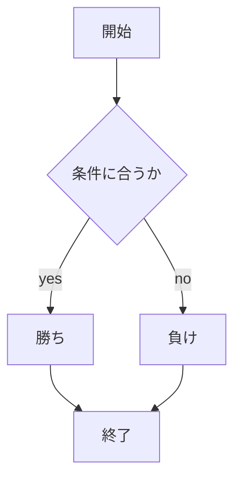

# webpro_06

##　じゃんけんの勝ち負け判定を追加している

##　ファイル一覧

ファイル名 | 説明
-|-
app5.js | プログラム本体
public/janken.html | じゃんけんの開始画面
test.html | Webプログラミングのテンプレート

```javascript
console.log('Hello');
```


```mermaid
flowchart TD;
    start["開始"]
    end1["終了"]
    if{"条件に合うか"}
    win["勝ち"]
    lose["負け"]
    
    start --> if
    if -->|yes| win
    win --> end1
    if -->|no| lose
    lose --> end1
```

