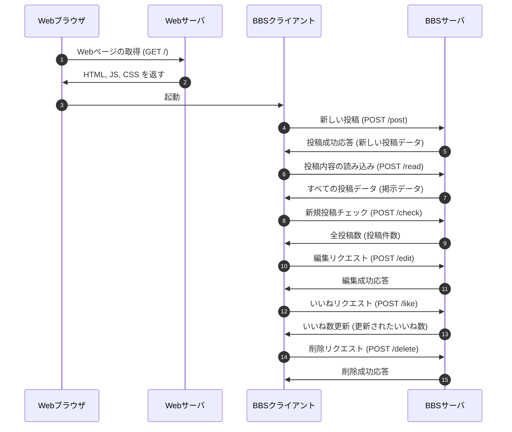

```mermaid
sequenceDiagram
    autonumber
    Webブラウザ ->> Webサーバ: Webページの取得 (GET /)
    Webサーバ ->> Webブラウザ: HTML, JS, CSS を返す
    Webブラウザ ->> BBSクライアント: 起動
    BBSクライアント ->> BBSサーバ: 新しい投稿 (POST /post)
    BBSサーバ ->> BBSクライアント: 投稿成功応答 (新しい投稿データ)
    BBSクライアント ->> BBSサーバ: 投稿内容の読み込み (POST /read)
    BBSサーバ ->> BBSクライアント: すべての投稿データ (掲示データ)
    BBSクライアント ->> BBSサーバ: 新規投稿チェック (POST /check)
    BBSサーバ ->> BBSクライアント: 全投稿数 (投稿件数)
    BBSクライアント ->> BBSサーバ: 編集リクエスト (POST /edit)
    BBSサーバ ->> BBSクライアント: 編集成功応答
    BBSクライアント ->> BBSサーバ: いいねリクエスト (POST /like)
    BBSサーバ ->> BBSクライアント: いいね数更新 (更新されたいいね数)
    BBSクライアント ->> BBSサーバ: 削除リクエスト (POST /delete)
    BBSサーバ ->> BBSクライアント: 削除成功応答
```
